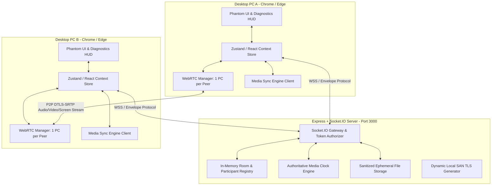

# PHANTOM ROOM

> **Production-Grade, Privacy-First, Room-Based Real-Time Communication Platform**

[](https://github.com/placeholder/phantom-room/actions)
[](https://nodejs.org/)
[](#-proprietary-license--distribution-notice)
[](https://www.typescriptlang.org/)

---

## 📖 Overview

**PHANTOM ROOM** is a private, ephemeral communication platform designed for frictionless peer-to-peer real-time interaction without phone numbers, user tracking, or persistent database storage.

Users create a room, receive a human-readable 4-character room code, and share it with peers. Once connected, participants can exchange real-time text chat, crystal-clear voice and video streams, desktop screen captures, sanitized file attachments, and collaborative media playback. When the room expires or the host leaves, all records, active streams, and in-memory references are completely purged.

---

## ⚡ Key Features

- 🔐 **Ephemeral Room Lifecycle**: Rooms and session state exist exclusively in volatile memory (RAM). Configurable automatic time-to-live (TTL) and instant host purge.
- 📹 **Resilient WebRTC Mesh**: Single-peer connection blueprint per participant with multi-tier hardware fallback, automatic track replacement (camera/mic toggling without call restart), and controlled ICE restart recovery.
- 🖥️ **Desktop Screen Sharing**: Native desktop capture with automatic track restoration to camera upon termination.
- 💬 **Real-Time Encrypted Chat**: Ordered message delivery with idempotent deduplication, code snippet syntax formatting, rich emoji reactions, and reply threading.
- 📁 **Sanitized File Sharing**: Client-side EXIF/GPS metadata stripping for image uploads, MIME-type validation, and categorised gallery filtering (`IMAGES`, `VIDEOS`, `AUDIO`, `DOCUMENTS`).
- 🎵 **Synchronized Room Media Player**: Sub-second authoritative audio/video clock synchronization with drift tolerance and anti-feedback echo suppression.
- 📻 **Compliant Spotify Connect Bridge**:
  - **Mode 1 (Dual Authenticated)**: Relays lightweight JSON playback control events (`play`, `pause`, `seek`, `trackChange`) across verified user Spotify Web Players.
  - **Mode 2 (Single User Fallback)**: Explains provider DRM restrictions with a legal fallback to high-fidelity shared room audio files (0 illegal audio proxying or rebroadcasting).
- 🛡️ **Anti-Abuse Protections**: Cryptographic dual-tier room mapping and sliding-window rate limiting to prevent brute-force passcode guessing attacks.
- 🔍 **Development Diagnostics HUD**: Real-time WebRTC telemetry overlay (`Ctrl + Shift + D`) with connection states, candidate types (`host`, `srflx`, `relay`), and live hardware media probing.

---

## 🏗️ Architecture



---

## 🛠️ Technology Stack

- **Frontend**: [Next.js 14 (App Router)](https://nextjs.org/), [React 18](https://react.dev/), [Tailwind CSS](https://tailwindcss.com/), [Lucide Icons](https://lucide.dev/), [Three.js](https://threejs.org/)
- **Backend / Realtime**: [Node.js](https://nodejs.org/), [Express](https://expressjs.com/), [Socket.IO 4.8](https://socket.io/), [TypeScript 5.6](https://www.typescriptlang.org/)
- **Media & Transport**: WebRTC (`RTCPeerConnection`, `getDisplayMedia`, `getUserMedia`), HTML5 Audio API
- **Testing & CI**: [Vitest](https://vitest.dev/), GitHub Actions

---

## 📋 Prerequisites

- **Node.js**: `v18.17.0` or higher (Node 20+ recommended)
- **npm**: `v9.0.0` or higher
- **Supported Browsers**: Google Chrome 110+, Microsoft Edge 110+, Mozilla Firefox 110+

---

## 🚀 Quick Start

### 1. Clone & Install
```bash
git clone https://github.com/your-username/phantom-room.git
cd phantom-room
npm install
```

### 2. Configure Environment
Copy the configuration template:
```bash
cp .env.example .env.local
```

### 3. Run Development Server (HTTP)
```bash
npm run dev
```
Open [http://localhost:3000](http://localhost:3000) in your browser.

---

## 🔒 HTTPS LAN Development (Multi-Device Testing)

Modern desktop browsers restrict camera and microphone access (`navigator.mediaDevices.getUserMedia`) to **Secure Contexts** (`https://` or `localhost`). When testing across multiple computers on a Local Area Network (e.g. `10.224.90.12` or `192.168.1.X`), start PHANTOM with development TLS:

```bash
npm run dev:https
```

- Development TLS certificates with Subject Alternative Names (SANs) covering `localhost`, `127.0.0.1`, `0.0.0.0`, and all detected local network interfaces are automatically generated in `certs/` on launch.
- Access the application from any computer on your network at `https://<YOUR_LAN_IP>:3000` (e.g., `https://10.224.90.12:3000`).

---

## 🧪 Testing & Verification

Run the automated Vitest test suite:
```bash
npm test
```

Run secret and security configuration audit:
```bash
node server/scripts/auditSecrets.js
```

Clean up orphaned port processes (if port 3000 is held by an old process):
```bash
npm run clean:port
```

---

## 🌐 WebRTC NAT & Firewall Configuration

PHANTOM includes Google public STUN servers by default for peer-to-peer hole punching.

For restrictive enterprise networks or symmetric NAT firewalls where direct P2P connections are blocked, configure a TURN relay server in your `.env.local`:

```env
TURN_URL=turn:turn.yourdomain.com:3478
TURN_USERNAME=your_username
TURN_CREDENTIAL=your_password
```

---

## 🔐 Security & Threat Boundaries

| Mechanism | Implementation Detail |
| :--- | :--- |
| **Data Persistence** | **Zero Database Disk Storage**: All room data is stored in volatile RAM and purged upon expiration. |
| **Transport Layer** | **TLS 1.3 / HTTPS & WSS**: Enforced transport security for all REST endpoints and WebSocket signaling. |
| **Media Streams** | **WebRTC DTLS-SRTP**: Audio, video, and screen capture streams are encrypted peer-to-peer using AES-GCM-128 / AES-CM-128. |
| **Metadata Protection** | **Client-Side EXIF Scrubbing**: Image uploads have camera hardware and GPS location tags stripped before transfer. |
| **Brute-Force Defense**| **Rate Limiter**: Sliding-window rate limiter with progressive IP lockouts on invalid room code guesses. |

> [!NOTE]
> Standard WebRTC audio/video streams use peer-to-peer DTLS-SRTP encryption directly between participating browser endpoints. Room text chat messages use client-side cryptographic hashing and ephemeral tokens for signaling transit.

---

## 📦 Production Deployment

### Production Build
```bash
npm run build
npm run start
```

### Docker Deployment
```bash
docker compose up -d --build
```

---

## 📄 Proprietary License & Distribution Notice

**PHANTOM is proprietary software.** The source code is maintained in a **private repository** and is **not licensed for redistribution, modification, public hosting, or reuse** without explicit written permission from the copyright holder.

The deployed PHANTOM application is publicly available for end-users to create private rooms, communicate in real-time, and share media in accordance with the application's terms of service and security model. Public application availability does not grant public access to the underlying proprietary source code.

---

## 🛡️ Security Vulnerabilities

Please review [SECURITY.md](SECURITY.md) for details on our security policies and how to report vulnerabilities responsibly.
